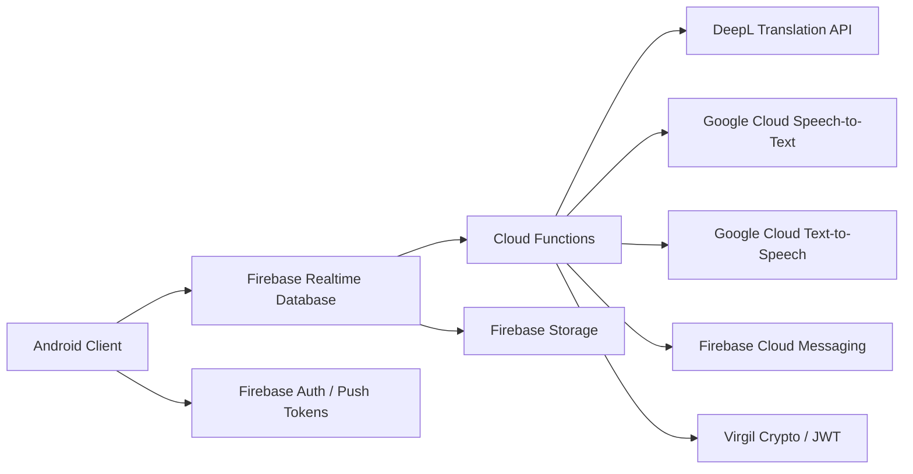

# Guapp Appli

Guapp Appli is a mobile chat platform inspired by WhatsApp, designed for multilingual communication. It lets users exchange text, voice notes, media, and group messages while automatically translating conversations across languages to reduce friction between speakers.

The product combines a native Android client with a serverless backend built on Firebase and Google Cloud services. The result is a real-time messaging experience that supports translation, speech transcription, text-to-speech, notifications, and secure message delivery.

## Project Structure

- `Youguage - Android app/`: Android client source, Gradle configuration, and app modules
- `functions/`: Firebase Cloud Functions for translation, speech processing, notifications, and messaging workflows
- `README.md`: project overview, architecture notes, and technology highlights
- `.gitignore`: excludes local IDE, build, and secret/config artifacts

## What Guapp Appli Does

- Real-time one-to-one and group chat
- Automatic translation of text messages into the recipient's language
- Voice message transcription with language-aware translation
- Text-to-speech generation for translated content
- Push notifications for incoming messages and group activity
- Media and file support, including images, videos, contacts, and locations

## Architecture Overview

Guapp Appli follows a client-server, event-driven architecture:

### Key Architectural Concepts

- Event-driven backend: message creation triggers cloud functions that transform, route, and notify in near real time.
- Translation pipeline: text messages are normalized and translated server-side before being delivered to the recipient.
- Voice workflow: audio messages can be transcribed with Google Speech-to-Text and then translated for the target user.
- Secure messaging support: Virgil JWT and crypto integration prepare the app for encrypted or identity-backed communication flows.
- Scalable Firebase data model: Realtime Database is used to separate message streams, user state, group membership, blocked users, and notification tokens.
- Modular Android structure: the client is organized with Gradle modules and native Android libraries, with local persistence support through Realm.

## Technology Stack

### Mobile Layer

- Android native application
- Gradle multi-module build
- Kotlin/Java Android stack
- Realm local database
- Firebase client SDKs

### Backend Layer

- Firebase Cloud Functions
- Firebase Realtime Database
- Firebase Cloud Messaging
- Firebase Admin SDK
- Firebase Storage

### AI / Communication Services

- DeepL API for text translation
- Google Cloud Speech-to-Text for voice transcription
- Google Cloud Text-to-Speech for audio generation
- Virgil SDK and Virgil Crypto for secure identity/token workflows

## Why This Project Stands Out

Guapp Appli is more than a chat app: it is a language bridge for mobile messaging. The core value is removing language barriers in daily conversations while keeping the experience familiar, fast, and mobile-first.

The main strengths to highlight in GitHub are:

- multilingual real-time messaging
- automatic translation for both text and voice
- cloud-driven event processing
- strong integration with Firebase and Google Cloud
- scalable design suitable for international chat use cases

## Repository Positioning

This repository contains the Android application and the supporting serverless functions that power message delivery, translation, transcription, and notifications.

If you want a short public-facing summary for GitHub, you can use:

> Guapp Appli is a multilingual chat application inspired by WhatsApp, featuring real-time messaging, automatic text translation, voice transcription, text-to-speech, and Firebase-powered cloud services.
